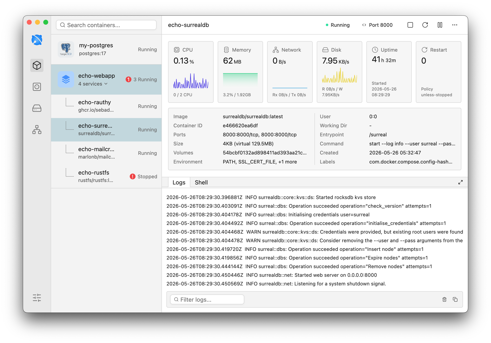

<p align="center">
  
</p>


<h1 align="center">Echo</h1>

<p align="center">
  A lightweight, high-performance desktop app for managing local Docker environments with a clean visual interface, real-time metrics, logs, and an integrated shell.
</p>



## Features

- **Cross-platform desktop foundation**: built with Rust and GPUI for a fast native experience across modern desktop environments.
- **Local Docker management**: follows your current Docker setup through `DOCKER_HOST`, Docker context, or Docker defaults.
- **Visual container workspace**: browse containers, grouped Compose services, images, volumes, and networks from one interface.
- **Real-time charts**: monitor CPU, memory, network, disk, uptime, and restart status with live area charts.
- **Container operations**: start, stop, restart, pause, resume, remove, and open exposed ports directly from the UI.
- **Logs and shell**: inspect streaming logs with filtering, then jump into an interactive container shell when needed.
- **Resource views**: manage Docker images, volumes, and networks, including import flows and network creation.
- **Responsive UI preferences**: switch between light and dark mode, choose app language, and adjust display preferences.
- **Backend-ready architecture**: the Bridge layer keeps Docker access behind a unified boundary so future connection targets can be added without coupling the UI to a specific engine.

## Getting Started

### Download

MVP builds are published on the [GitHub Releases](https://github.com/echo-and/echo/releases) page.

Echo currently ships as unsigned portable archives:

- macOS: `echo-*-apple-darwin.tar.gz`
- Linux: `echo-*-unknown-linux-gnu.tar.gz`
- Windows: `echo-*-windows-msvc.zip`

The MVP release does not include installers, code signing, or notarization yet. On macOS and Windows, your operating system may show an unsigned-app warning.

### Prerequisites

- Rust toolchain with the 2024 edition supported.
- A local Docker-compatible engine, such as Docker Desktop, Docker CE, Colima, Lima, or OrbStack.
- Docker CLI is recommended so Echo can follow the active Docker context.

### Run from source

```sh
cargo check
cargo run
```

Echo resolves the active Docker endpoint in this order:

1. `DOCKER_HOST`
2. `docker context inspect`
3. Docker defaults

## How Echo Works

Echo is organized around a small set of layers:

- **UI**: GPUI and `gpui-component` render the workspace, navigation, settings, charts, logs, and shell.
- **App model**: owns state, preferences, selected resources, sync status, and background task lifetimes.
- **Bridge**: provides a single Docker control plane for listing resources, watching events, streaming logs, opening shells, and running actions.
- **Local backend**: uses `bollard` and Tokio to talk to the local Docker API.

The current implementation focuses on local Docker. Additional connection targets are intentionally treated as future work rather than current shipped features.

## Tech Stack

- Rust 2024
- GPUI
- gpui-component
- Tokio
- Bollard
- rust-i18n

## Project Structure

```text
src/
  app/       Application model, services, preferences, tray, and window lifecycle
  bridge/    Docker endpoint resolution, sessions, sync, and local backend access
  ui/        GPUI views for containers, images, volumes, networks, settings, charts, and terminal
  domain.rs  Backend-independent Docker domain models
  i18n.rs    Locale state and translation helpers
```

## Roadmap

- Installers, code signing, and notarized macOS builds.
- Deeper network and resource inspection.
- More import/export workflows for images and volumes.
- Additional Docker-compatible connection targets through the existing Bridge boundary.

## Development

Useful checks while working on Echo:

```sh
cargo fmt --check
cargo check --locked
cargo test --locked
cargo clippy --locked -- --deny warnings
cargo build --release --locked
```

## Status

Echo is under active development. The current app is intended for local Docker workflows and may change as the resource model, packaging, and connection layer evolve.

## License

Echo is licensed under the Business Source License 1.1. See [LICENSE](LICENSE) for details.

## Contributing

See [CONTRIBUTING.md](CONTRIBUTING.md) for development checks and pull request expectations.
